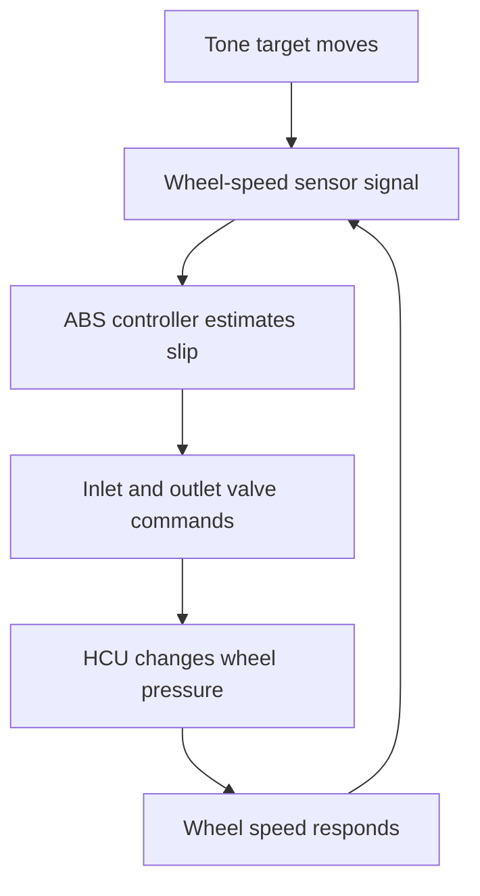
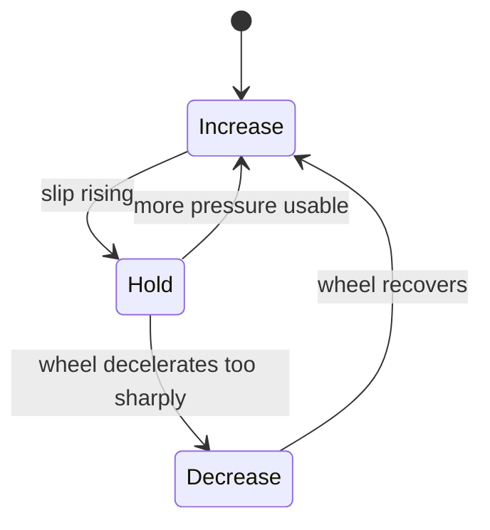
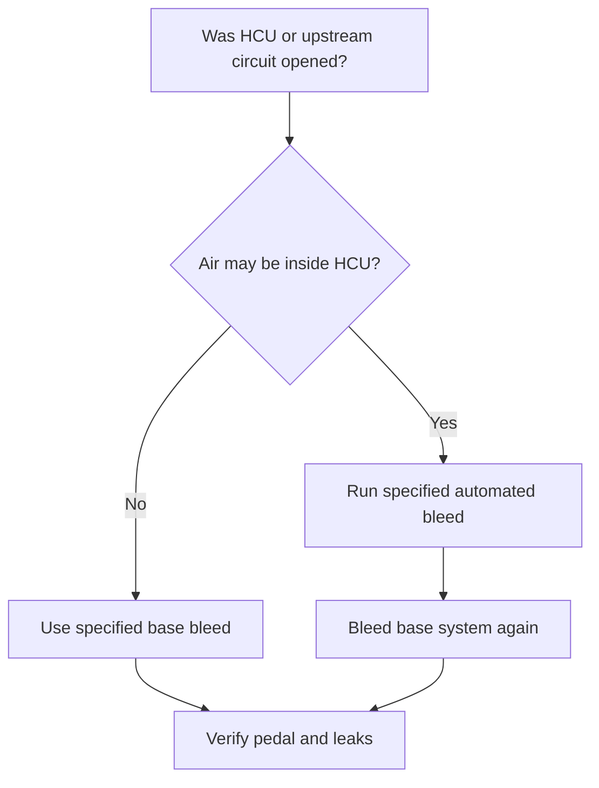
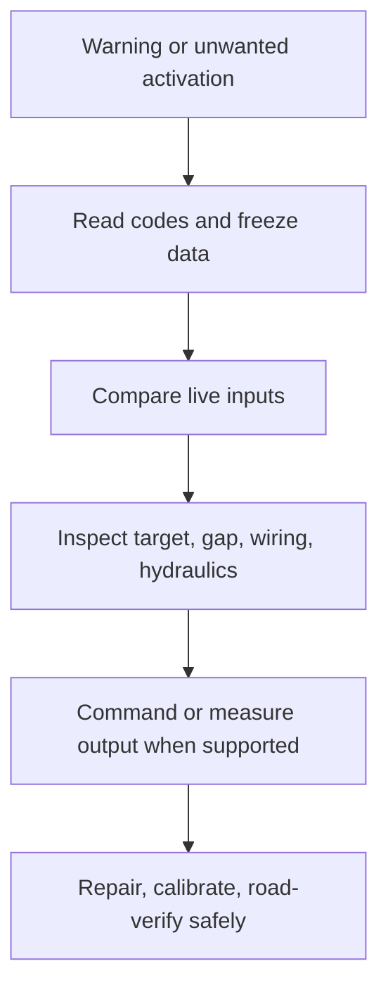

# Brakes II — ABS, HCU and stability control

This cluster covers ABS components, pump/motor and solenoid operation, HCU
bleeding, ABS fault diagnosis, and the ABS/traction/stability-control
relationship. The technical lesson below is a synthesis around those topics;
the supplied titles remain an index, not a claim that every video has been
transcribed.

## Drawing 1 — information path and pressure path

This is a feedback loop. A fault can enter through the measured motion, the
target, sensor air gap, wiring, controller decision, valve/pump execution, or
the base brake itself. An ABS code naming a wheel-speed circuit does not prove
the sensor alone is bad.

## The three hydraulic states

A simple two-solenoid channel can be understood as three commands. Exact valve
construction and naming vary, but the pressure logic is stable:

| Command | Inlet from master | Outlet to low-pressure side | Wheel pressure |
|---|---|---|---|
| Increase | Open | Closed | Follows/rises with driver input |
| Hold | Closed | Closed | Approximately held |
| Decrease | Closed | Open | Drops as fluid leaves wheel circuit |

The return pump moves released fluid so modulation can continue and pedal
travel remains controlled. The pump does not replace the driver’s base-brake
pressure source.

ABS does not seek zero wheel slip. It cycles pressure near a useful slip region
while trying to preserve steerability and braking. Gravel, deep snow, tire
condition, and road split-friction change the outcome; the controller only has
the signals and actuators installed on that vehicle.

## Wheel-speed diagnosis

Compare signals under the conditions where the symptom occurs. A low-speed
false activation often appears when one signal drops out earlier than the
others. Possible mechanisms include:

- damaged, cracked, rusty, or contaminated tone target;
- excessive or changing sensor air gap;
- bearing/hub play moving the target relative to the sensor;
- wiring that opens with steering or suspension motion;
- incorrect replacement part or target tooth count;
- weak sensor output or biased active-sensor supply/ground;
- different tire rolling circumference.

The discriminating test is comparison, not merely resistance at rest. Graph
all wheel speeds together, inspect the suspect target and gap, and use the
correct signal test for passive versus active sensors.

## Air in the HCU

Ordinary wheel bleeding moves fluid through the base paths. Air trapped behind
normally closed HCU valves may remain isolated. Many systems therefore require
a service procedure that commands the pump and solenoids, followed by another
conventional bleed.

Do not assume every ABS code or pump noise demands an HCU bleed. The procedure
addresses trapped air; it does not repair electrical faults or leaking valves.

## ABS, traction control, and stability control

These systems share hardware but ask different questions:

| Function | Main comparison | Typical intervention |
|---|---|---|
| ABS | Is a braked wheel approaching lock relative to vehicle motion? | Reduce/hold/reapply that wheel’s brake pressure |
| Traction control | Is a driven wheel spinning excessively? | Brake a spinning wheel and/or reduce drive torque |
| Stability control | Is actual yaw/lateral response inconsistent with driver steering intent? | Brake selected wheel(s) and/or reduce drive torque |

Stability control therefore needs more than wheel speeds: commonly steering
angle, yaw rate, lateral acceleration, brake-pressure or pedal information,
plus reliable calibration. A steering-angle sensor centered at the wrong value
can produce a plausible signal that represents the wrong driver intent.

## Fault-reading discipline

- A pump-motor code can describe the motor, power/ground, relay/driver, wiring,
  mechanical pump load, or controller monitoring path.
- A warning lamp often leaves conventional base braking available, but exact
  fallback behavior is vehicle-specific.
- Clearing a code is not a repair and removes evidence if done before reading
  stored conditions.
- After hub, alignment, steering, or sensor work, check whether the vehicle
  requires steering-angle or related calibration.

## Video-guided study questions

- `2Ll5jA1tZEw`: name each component and place it in either the information
  path or hydraulic-pressure path.
- `IKi5O3ZlSu4` and `-IUZWwMm7nY`: narrate increase, hold, and decrease without
  using the vague phrase “the ABS pumps the brakes.”
- `UmGEYy_gj7A` and `e98w_n0g0RY`: distinguish air-removal procedure from
  electrical/mechanical pump diagnosis.
- `Ts-cZj81bUA`: sort each failure into input, decision, or hydraulic-output
  failure.
- `-P6OhJjgI6w`: treat the BMW fault numbers as a case study, not a universal
  definition of an ABS pump failure.
- `qHf1qo31-aw`: identify which sensors and actuators are shared by ABS,
  traction control, and stability control, and which control objective changes.

- **02. ABS System and Components** — **also in first A5 source**
  - Channel: Raybestos Brakes
  - Duration: 3:02
  - Video ID: `2Ll5jA1tZEw`
  - https://www.youtube.com/watch?v=2Ll5jA1tZEw

- **03. How an ABS Motor Works** — **also in first A5 source**
  - Channel: speedkar99
  - Duration: 3:18
  - Video ID: `IKi5O3ZlSu4`
  - https://www.youtube.com/watch?v=IKi5O3ZlSu4

- **05. Brake Bleeding And The ABS HCU | Tech Minute** — **also in first A5 source**
  - Channel: Babcox Media
  - Duration: 1:24
  - Video ID: `UmGEYy_gj7A`
  - https://www.youtube.com/watch?v=UmGEYy_gj7A

- **24. Exploring ABS Anti-Lock Brakes: A Deep Dive into Function and Faults** — **also in first A5 source**
  - Channel: ECU TESTING
  - Duration: 10:09
  - Video ID: `Ts-cZj81bUA`
  - https://www.youtube.com/watch?v=Ts-cZj81bUA

- **25. BMW ABS Light Caused By 5DF0 & 5DF1 Fault**
  - Channel: ECU TESTING
  - Duration: 3:20
  - Video ID: `-P6OhJjgI6w`
  - https://www.youtube.com/watch?v=-P6OhJjgI6w

- **30. ABS Operation (Solenoid)** — **also in first A5 source**
  - Channel: Automotive Mechanism worldwide
  - Duration: 2:24
  - Video ID: `-IUZWwMm7nY`
  - https://www.youtube.com/watch?v=-IUZWwMm7nY

- **31. How a Car Braking System Works: ABS, Traction & Stability Control Explained** — **also in first A5 source**
  - Channel: speedkar99
  - Duration: 15:06
  - Video ID: `qHf1qo31-aw`
  - https://www.youtube.com/watch?v=qHf1qo31-aw

- **41. 4 Signs Your ABS Pump is Bad and Failing (How to get of air quickly after replacement)**
  - Channel: Top 5 Auto Repairs
  - Duration: 5:52
  - Video ID: `e98w_n0g0RY`
  - https://www.youtube.com/watch?v=e98w_n0g0RY
