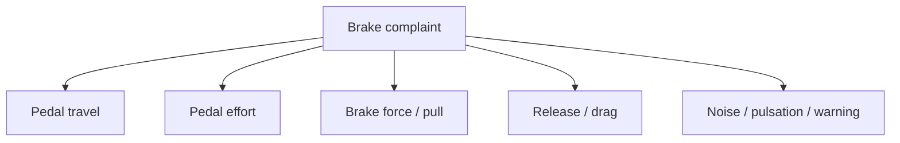
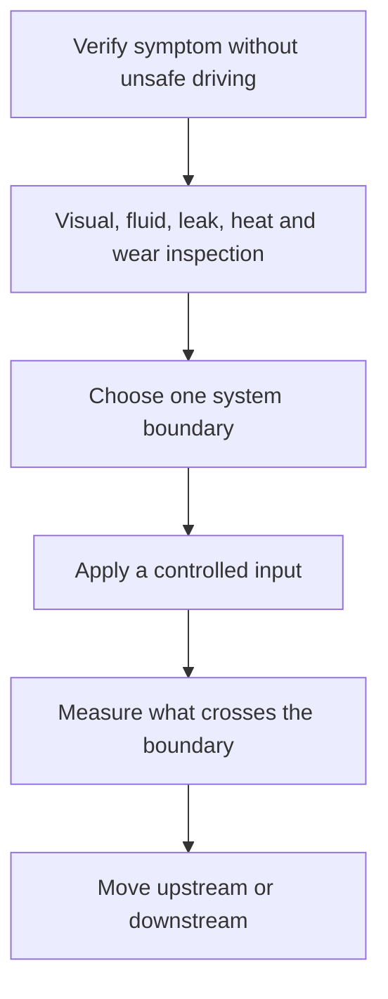
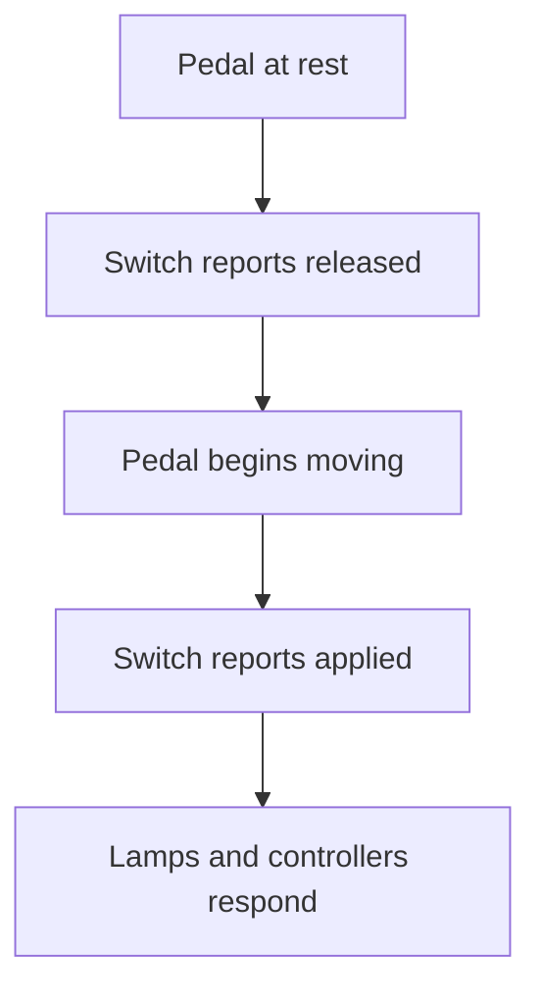

# Brakes II — diagnosis and component checks

This cluster is centered on symptom diagnosis, isolating components before
condemning them, brake-light-switch adjustment, and broad brake-system
component review. The technical lesson below is a synthesis around those
subjects; the supplied titles are not being presented as transcript evidence.

## Drawing 1 — split the complaint before naming a part



“Bad brakes” is not a diagnosis. The first move is to preserve the exact
conditions: cold or hot, engine on or off, first press or second press,
straight-line or turning, one wheel or all wheels, applying or releasing.

## Symptom-to-mechanism matrix

| Observation | Mechanism families | Separating observation or test |
|---|---|---|
| Hard, high pedal | Lost assist; seized mechanical linkage; restricted hydraulic path | Compare engine-off/start assist response; inspect architecture-specific assist source |
| Long first press, higher second press | Air/vapor; excessive shoe/pad clearance; pad knockback; lost motion | Note pump-up; inspect rear adjustment, hub/runout, leaks, and bleed history |
| Pedal sinks while steady force is held | External leak; internal master-cylinder bypass | Inspect for fluid loss/leaks; use service-specified master isolation test |
| Vehicle pulls during braking | Strong/grabbing brake on pull side or weak brake opposite | Compare temperature, friction condition, pressure, and wheel-end movement side to side |
| One wheel stays hot | Mechanical bind or trapped pressure | Safely open that wheel’s bleeder and observe whether it releases |
| All brakes drag after warming | Master return/compensation fault, pushrod/free-play fault, assist linkage, contaminated fluid, upstream control issue | Check free play and whether releasing pressure at progressively upstream boundaries frees all wheels |
| Pedal pulsates periodically | Thickness/friction variation, runout-generated variation, ABS activation | Correlate with wheel rotation and ABS data; measure rather than call rotor “warped” |
| Red BRAKE lamp | Parking-brake switch, low fluid, pressure-differential switch, other vehicle-specific warning input | Identify which inputs feed the lamp before replacing hydraulic parts |

## Drawing 2 — the isolation ladder



The smallest informative test wins. Examples:

- At a hot wheel, the bleeder separates trapped pressure from a mechanical
  bind.
- At the booster, the engine-off/start test separates assist arrival from base
  hydraulic travel.
- At the master cylinder, only the specified plugged-port or pressure test can
  isolate it from downstream volume; pinching an ordinary hose with arbitrary
  tools can damage it and create a new fault.
- At an ABS wheel-speed input, a graph of all wheel speeds separates an
  intermittent signal from a hydraulic modulator command.

## Why two people can matter

One person supplies a repeatable input while the other observes the component:

```mermaid
sequenceDiagram
    participant P as Pedal operator
    participant O as Observer
    P->>O: State pedal condition and applied force
    P->>P: Apply and hold; do not pump unless requested
    O->>O: Inspect motion, leak, pressure or release
    O->>P: Request one controlled change
    P->>O: Report pedal movement during the change
```

The instructions matter. “Hold steady” and “pump repeatedly” are different
tests. Pumping can hide a sinking pedal, temporarily take up clearance, move a
pressure-differential valve, or change a leak rate.

## Long pedal: account for every millimetre

The Ram Man companion-document evidence for knockback, shoe clearance, and the
assist/travel distinction is recorded in the
[slow source-review note](../../reviewed/ram-man-pedal-travel.md).

Pedal travel can be spent in several places:


This turns “excessive travel” into a volume budget. If pumping makes the pedal
higher, ask what clearance or compressible volume the first stroke filled. If
steady pressure makes it continue sinking, ask where fluid is escaping or
bypassing. If the engine start makes it move once as assist appears, do not
mistake that normal force multiplication for proof of hydraulic failure.

## Brake-light switch lesson

The stop-light switch is an input device, not a brake adjustment. Depending on
the vehicle it may be a simple normally-open contact, a self-adjusting plunger,
a redundant position sensor, or an input shared with shift interlock, cruise
control, ABS, and stability control.



An incorrectly adjusted switch can leave lamps on, delay lamp application, or
give controllers implausible pedal information. Adjustment must not preload the
brake pedal or mask missing pedal free play. Confirm lamp operation and scan
data where applicable after adjustment.

## Technician A / Technician B practice

Evaluate each statement independently. Then ask which mechanism would make it
true and which observation would falsify it.

Example:

- Technician A says a failed booster can cause a hard pedal. **True**: lost
  assist raises required effort.
- Technician B says air in the lines normally causes a hard, high pedal.
  **False**: compressible gas more often creates increased/spongy travel.

The point is not memorizing the pair. It is preventing one true statement from
making the other one feel true by association.

## Video-guided study questions

- `3SnbEIu8ND8`: write the exact role of the pedal operator and observer for
  each test. Mark where pumping would invalidate the observation.
- `Zi4UfqPd-oE`: for every component check, name the upstream input, downstream
  output, and the boundary being isolated.
- `KNo7wud4gDg`, `KCw-ky1ozoE`, `lLgZejoH-p0`, and `VWoWsNPAZ2k`: build one
  continuing fault tree rather than four disconnected lists of bad parts.
- `ye1Y5R--5m8`: identify the switch’s electrical rest/applied states and make
  sure adjustment does not alter pedal or master-cylinder return.
- `6Y31pQl16Pw`: classify each component as input, force multiplier, pressure
  transmitter, pressure controller, friction device, sensor, or warning output.

- **11. HOW TO DIAGNOSE BRAKE PROBLEMS...FYI IT TAKES TWO PEOPLE!**
  - Channel: TheRamManINC
  - Duration: 9:06
  - Video ID: `3SnbEIu8ND8`
  - https://www.youtube.com/watch?v=3SnbEIu8ND8

- **12. BRAKE DIAGNOSTICS: YOU MUST ISOLATE THE PART TO PROPERLY CHECK IT**
  - Channel: TheRamManINC
  - Duration: 5:13
  - Video ID: `Zi4UfqPd-oE`
  - https://www.youtube.com/watch?v=Zi4UfqPd-oE

- **13. MOPAR BRAKE LIGHT SWITCH (ADJUSTMENT) by TheRamManINC.com**
  - Channel: TheRamManINC
  - Duration: 2:04
  - Video ID: `ye1Y5R--5m8`
  - https://www.youtube.com/watch?v=ye1Y5R--5m8

- **15. BRAKE PROBLEMS DIAGNOSTICS PART ONE** — **also in first A5 source**
  - Channel: TheRamManINC
  - Duration: 12:17
  - Video ID: `KNo7wud4gDg`
  - https://www.youtube.com/watch?v=KNo7wud4gDg

- **16. BRAKE PROBLEMS DIAGNOSTICS PART TW0** — **also in first A5 source**
  - Channel: TheRamManINC
  - Duration: 7:49
  - Video ID: `KCw-ky1ozoE`
  - https://www.youtube.com/watch?v=KCw-ky1ozoE

- **17. BRAKE PROBLEMS DIAGNOSTICS PART THREE** — **also in first A5 source**
  - Channel: TheRamManINC
  - Duration: 9:45
  - Video ID: `lLgZejoH-p0`
  - https://www.youtube.com/watch?v=lLgZejoH-p0

- **18. BRAKE PROBLEMS DIAGNOSTICS PART FOUR** — **also in first A5 source**
  - Channel: TheRamManINC
  - Duration: 10:38
  - Video ID: `VWoWsNPAZ2k`
  - https://www.youtube.com/watch?v=VWoWsNPAZ2k

- **21. Brake System Components and Diag**
  - Channel: McCuistian
  - Duration: 26:13
  - Video ID: `6Y31pQl16Pw`
  - https://www.youtube.com/watch?v=6Y31pQl16Pw
