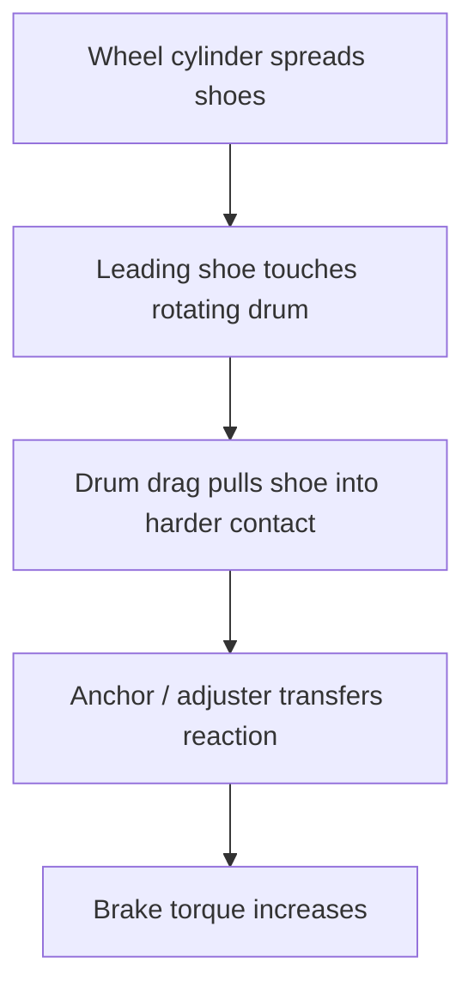
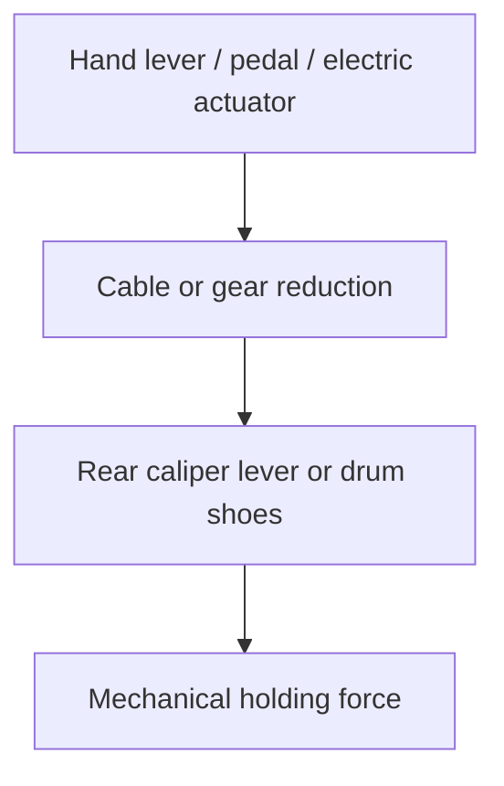
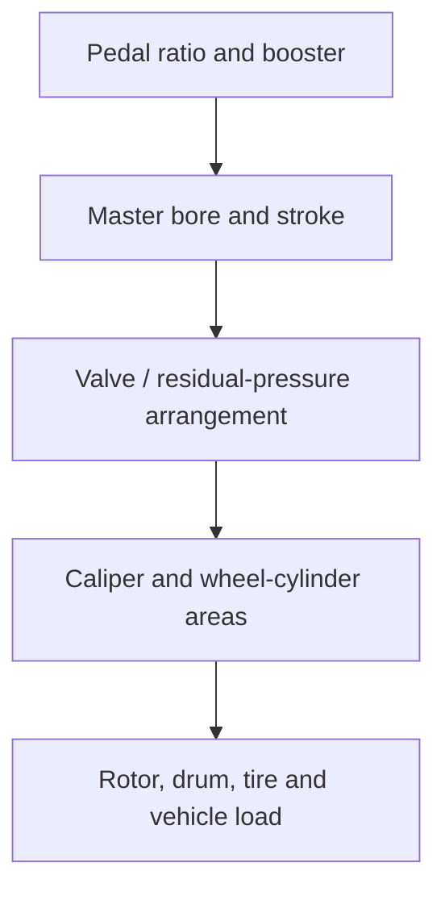
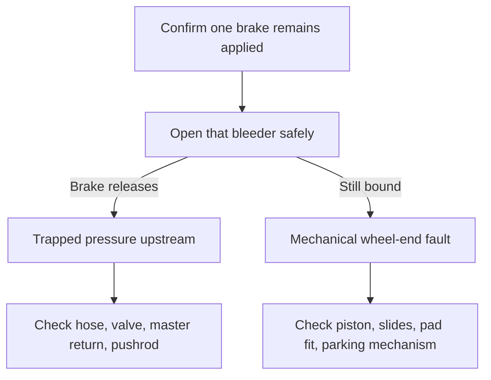

# Brakes II — disc, drum and parking brakes

This cluster covers disc-brake operation and machining, disc conversion,
drum-brake types, parking brakes, and brake binding. The technical lesson is a
synthesis around those subjects; the video list remains a title/metadata index
unless a transcript is explicitly cited.

## Drawing 1 — floating-caliper force path

The piston and slides do different jobs. A piston that will not advance can
make the corner weak. A piston that will not retract can make it drag. Slides
that bind prevent the floating body from sharing clamp load normally and often
leave unequal pad wear.

### Wear is a motion record

| Observation | Useful interpretation, not a verdict |
|---|---|
| One pad much thinner than its mate | Piston, slides, pad fit, or caliper-body motion is unequal |
| Tapered pad | Pad/caliper is not staying square or moving freely |
| Both pads thin and rotor blue/hot | Brake may have remained applied or vehicle use generated extreme heat |
| One corner hot but bleeder does not release it | Wheel-end mechanical bind becomes more likely |
| One corner hot and bleeder releases it | Trapped hydraulic pressure upstream is established |

Pad location matters only after caliper design is identified. “Inner pad means
X” is not a safe universal rule.

## Drawing 2 — self-energizing drum brake

Drum geometry can use rotation to multiply shoe force. Leading/trailing and
duo-servo layouts transfer that reaction differently, so shoe position,
adjuster orientation, and spring placement are not interchangeable.

Excess shoe-to-drum clearance consumes wheel-cylinder travel before useful
pressure rises. That can create a low first pedal that pumps higher. A poor
adjuster, incorrect assembly, worn drum, or parking-brake adjustment issue can
therefore look like “air” unless clearance is checked.

## Parking brake is a separate apply path

The parking brake may use the service-brake shoes, a screw mechanism inside a
rear caliper, or small drum-in-hat shoes. Diagnosis begins by identifying the
architecture. A seized cable can hold both the lever and friction element; a
free cable with a stuck caliper screw mechanism is a different boundary.

For electric parking brakes, use the specified service mode before retracting
or rotating pistons. Motor current, gear position, calibration, and mechanical
binding can all produce similar complaints.

## Rotor machining lesson

Machining is a measurement decision, not a ritual performed whenever pads are
replaced.

1. Identify the discard/minimum thickness and any machining specification.
2. Inspect for cracks, severe heat damage, corrosion, and hard spots.
3. Measure thickness at several equally spaced positions.
4. Check hub face, bearing condition, and assembled lateral runout.
5. Predict the finished thickness after enough material is removed to clean up
   both faces.
6. Clean the finished rotor and verify the assembly again.

Lateral runout is side-to-side wobble. Disc thickness variation is a change in
thickness around the rotor. Friction-material transfer can change brake torque
without either measurement alone explaining the complaint. Keep all three
separate.

## Disc-conversion systems lesson

The two Mopar conversion videos are best studied as a system-matching problem:

A conversion is not correct merely because its brackets bolt on. Verify pedal
free play, full stroke without bottoming, adequate reservoir volume, correct
line and hose routing, wheel clearance, bleeders at the high point, front/rear
bias, parking-brake operation, and safe failure behavior. A proportioning valve
can reduce rear pressure; it cannot compensate for every master/caliper/pedal
mismatch.

## Binding decision drawing

This test should be performed only with the vehicle safely supported and the
system restored and bled before operation. A hot wheel should cool before
disassembly; overheated fluid and components can injure and can fail after the
original bind is repaired.

## Video-guided study questions

- `GTgi0BND3IY`: list every measurement required before deciding a rotor is
  machinable, then list the checks repeated after machining and installation.
- `cKqz5MK6pX0` and `vA9H6oGpnQA`: trace the entire conversion from pedal to
  tire and identify every matched parameter, not only the spindle/caliper
  hardware.
- `STGclG0w8vA`: draw the force reaction for each drum type and mark which shoe
  is leading in forward and reverse rotation.
- `h6ej2BoAmvA`: identify the mechanical apply path and how the adjuster or
  caliper screw mechanism affects service-brake pedal travel.
- `hD2z1P5qMUY`: use the animation to distinguish piston motion, caliper-body
  motion, seal rollback, and rotor rotation.
- `RrSn0M7n9eE`: stop at each diagnostic boundary and predict whether opening
  the bleeder should change the symptom.

- **06. How to machine brake disks**
  - Channel: Way of the Wrench
  - Duration: 21:53
  - Video ID: `GTgi0BND3IY`
  - https://www.youtube.com/watch?v=GTgi0BND3IY

- **08. MOPAR DISC BRAKE CONVERSION DOCTORATE (PART 1 OF 2), BY THERAMMANINC.COM**
  - Channel: The Ram Man Inc.
  - Duration: 12:59
  - Video ID: `cKqz5MK6pX0`
  - https://www.youtube.com/watch?v=cKqz5MK6pX0

- **09. MOPAR DISC BRAKE CONVERSION DOCTORATE (PART 2 OF 2), BY THERAMMANINC.COM**
  - Channel: The Ram Man Inc.
  - Duration: 13:22
  - Video ID: `vA9H6oGpnQA`
  - https://www.youtube.com/watch?v=vA9H6oGpnQA

- **32. Types of Drum Brakes** — **also in first A5 source**
  - Channel: Raybestos Brakes
  - Duration: 3:02
  - Video ID: `STGclG0w8vA`
  - https://www.youtube.com/watch?v=STGclG0w8vA

- **33. How Parking Brakes Work** — **also in first A5 source**
  - Channel: speedkar99
  - Duration: 5:09
  - Video ID: `h6ej2BoAmvA`
  - https://www.youtube.com/watch?v=h6ej2BoAmvA

- **35. How do disc brakes work in cars and light vehicles. (3D animation)**
  - Channel: No User Serviceable Parts
  - Duration: 4:41
  - Video ID: `hD2z1P5qMUY`
  - https://www.youtube.com/watch?v=hD2z1P5qMUY

- **45. Brake Binding – How to Find The Cause and Fix it!** — **also in first A5 source**
  - Channel: ECU TESTING
  - Duration: 3:35
  - Video ID: `RrSn0M7n9eE`
  - https://www.youtube.com/watch?v=RrSn0M7n9eE
