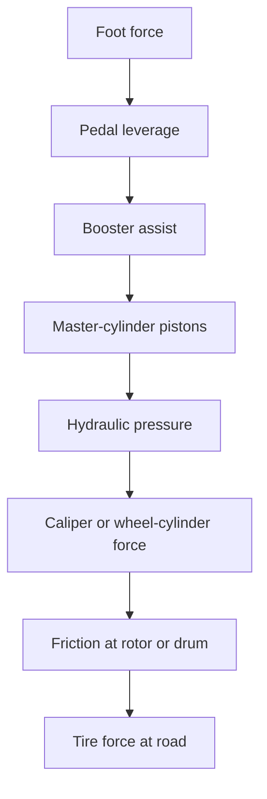
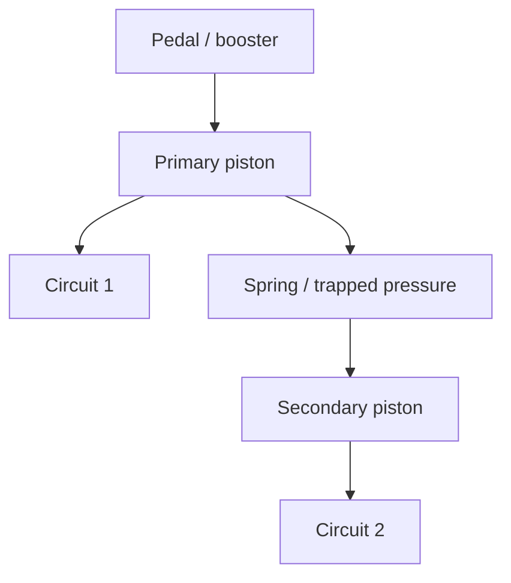
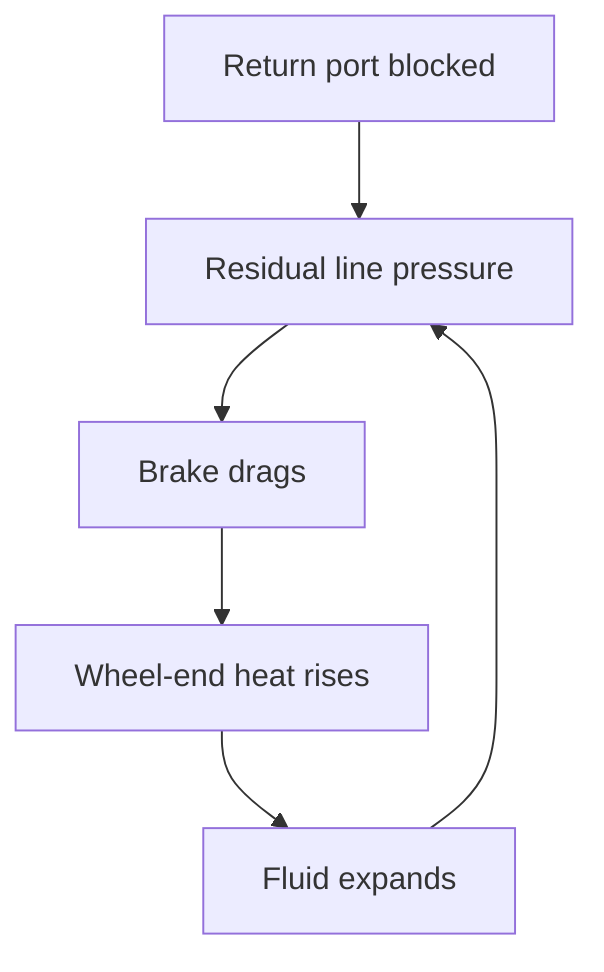
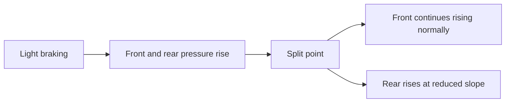
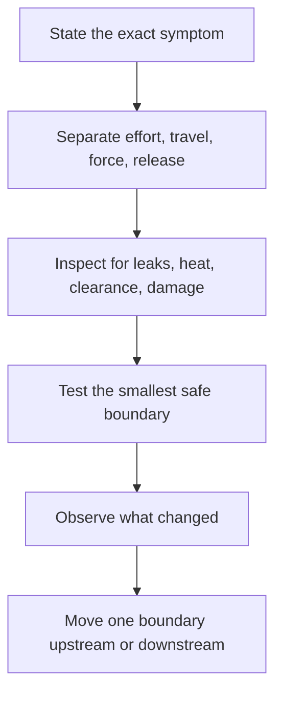

# Brakes II — hydraulics, valves and boosters

This began as a title/metadata index. It now also contains a technical lesson
built around the subjects in the supplied videos. The lesson is not attributed
to a speaker unless transcript evidence is explicitly identified. `Types of
Hydraulic Valves` is generic hydraulic material rather than an
automotive-brake-specific source, so use it only for conceptual background.

## Drawing 1 — the force and pressure path

The drawing is a diagnostic chain. A fault near the top can change pedal
effort without changing free travel. A leak, gas bubble, excessive wheel-end
clearance, or blocked return path changes a different part of the chain.

The two useful hydraulic relations are:

$$
p = \frac{F}{A}, \qquad V = A s
$$

For the same master-cylinder input force, a smaller master bore produces more
line pressure. But it must move farther to displace the same fluid volume. A
larger bore trades the other way: less travel, more required input force. That
is why master-cylinder bore, caliper/wheel-cylinder area, pedal ratio, and
booster assist must be treated as one matched system.

Pressure is not the same thing as fluid flow. Once pads and shoes contact their
friction surfaces, little fluid motion is needed to raise pressure. A low pedal
often means fluid volume was spent taking up clearance or compressing gas
before pressure could rise.

## Drawing 2 — tandem master cylinder

This is a functional drawing, not the port layout of a particular master
cylinder. With both circuits intact, hydraulic pressure and spring force move
the two piston sections together. If one circuit fails, extra piston travel
brings a mechanical or hydraulic backup path into play so the other circuit
can still build pressure. The result is usually a much lower pedal and reduced
braking, not normal operation.

At rest, the piston seals must uncover the reservoir compensation ports. If a
pushrod is too long, the pedal has no required free play, or a piston cannot
return, the ports may stay covered. Fluid heated at a wheel then expands but
cannot return to the reservoir:

That positive-feedback loop explains why a brake may begin only slightly tight
and become severe after driving. Opening a bleeder may release it, but the
bleeder test only proves trapped pressure exists upstream of that bleeder. It
does not by itself identify whether the restriction is a hose, valve, master
cylinder, or pushrod/return problem.

## Valve functions: do not merge the names

The Ram Man companion-document evidence behind this distinction is recorded in
[the slow-review valve note](../../reviewed/ram-man-proportioning-metering.md).

| Device | Actual job | What it does **not** establish |
|---|---|---|
| Pressure-differential switch | Detects a large pressure imbalance between two hydraulic circuits and may light the red warning lamp | It does not normally proportion front/rear pressure |
| Metering or hold-off valve | On some older disc/drum systems, delays initial front-disc application so rear shoes can overcome spring force | It is not an ABS inlet valve |
| Proportioning valve | Above a split point, reduces the rate at which rear pressure rises relative to master-cylinder pressure | It cannot add front pressure or cure air/clearance |
| Load-sensing valve | Changes rear-pressure control with suspension/axle position as a proxy for rear load | Its linkage position is not arbitrary adjustment |
| Residual-pressure valve | Maintains a small specified rest pressure in a circuit designed for it | It must not be added merely because a pedal feels low |
| Combination valve | Packages some combination of differential switch, metering, and proportioning functions | The name alone does not tell which functions are inside |

### Proportioning-valve pressure picture

Before the knee or split point, rear pressure often follows master-cylinder
pressure closely. Above it, rear pressure continues to rise, but at a smaller
rate. It is not normally a valve that simply turns the rear brakes off.

The reason is load transfer. During harder deceleration, normal force shifts
forward. The rear tires then reach lockup with less brake torque than they
could use at rest. An adjustable valve is therefore a tuning and validation
device, not a cure-all. It can only remove rear pressure; safe adjustment
requires the correct system design and controlled testing.

## Booster lesson

A booster multiplies input force. It does not create hydraulic fluid volume.
That makes the symptom split important:

| Symptom | First family to test |
|---|---|
| Hard, high pedal | Assist source, check valve, booster, hydroboost/electric-assist controls |
| Long pedal that pumps higher | Air/vapor, shoe or pad clearance, knockback, hydraulic travel |
| Pedal slowly sinks under steady force | External leakage or master-cylinder internal bypass |
| Brake applies but will not release | Mechanical bind or trapped hydraulic pressure |

For a conventional vacuum booster, exhaust stored vacuum with the engine off,
hold steady pedal force, and start the engine. A working assist system normally
causes a noticeable change in pedal position/effort. This checks whether assist
arrives. It does not clear the hydraulic system.

Booster pushrod adjustment belongs to both sides of the diagnosis. Too much
clearance creates dead travel before the master piston moves. Too little
clearance can prevent the master piston from fully returning and can cause
drag after the system warms.

## Isolation lesson from the Ram Man cluster

The directly inspectable source evidence and its limits are recorded in the
[hydraulic-diagnosis review](../../reviewed/ram-man-hydraulic-diagnosis.md) and
[pedal-travel review](../../reviewed/ram-man-pedal-travel.md).

The useful common idea across the diagnosis, excessive-travel, master-cylinder,
and valve titles is **isolate before replacing**:

Examples of a useful boundary are the wheel bleeder for trapped pressure, the
master-cylinder outlet test specified by service information, live wheel-speed
data at the ABS controller, or the engine-off/engine-start boundary for vacuum
assist. Random parts replacement destroys evidence.

## Video-guided study questions

- `BBTOp-Xzgug`, `qzUk8W1-2pw`, `VdlfzcWCeks`, `ffD7-554oi4`,
  `LTD6dxaNdhE`, `qPLaPv8DITE`, and `W0ZFuWyi5tQ`: identify which
  passages are differential warning, metering, fixed proportioning,
  adjustable proportioning, or load sensing. Do not call the whole block a
  proportioning valve without tracing ports.
- `jCZ-njSNKwk` and `7E0vdCcWk-A`: classify each excessive-travel cause as
  lost fluid, compressible volume, excess clearance, bypass, or lost motion.
- `_HioFTF2JPE`: trace the reservoir ports, piston seals, two outlets, and
  failure travel of the tandem master cylinder before thinking about part
  numbers.
- `wvpWRa0dW3w`, `zjeBZekjvbE`, `lJzbCA6qrBw`, and `eNG_z_X2ny0`:
  separate the energy source for assist from the hydraulic master-cylinder
  function. Vacuum, tandem vacuum, electro-mechanical, and restored vintage
  boosters need different checks.
- `_imyybhZV80`: use the system overview to narrate the complete force path
  from foot to tire, including where energy is amplified and where motion is
  merely transmitted.

- **01. PROPORTIONING VALVES EXPLAINED-  BY THERAMMANINC.COM** — **also in first A5 source**
  - Channel: The Ram Man Inc.
  - Duration: 12:52
  - Video ID: `BBTOp-Xzgug`
  - https://www.youtube.com/watch?v=BBTOp-Xzgug

- **04. Types of Hydraulic Valves**
  - Channel: Agri Supply®
  - Duration: 4:34
  - Video ID: `0-qH2avhq3U`
  - https://www.youtube.com/watch?v=0-qH2avhq3U

- **07. MOPAR MIDLAND ROSS TANDEM BOOSTER TEST, BY THERAMMANINC.COM**
  - Channel: The Ram Man Inc.
  - Duration: 1:33
  - Video ID: `wvpWRa0dW3w`
  - https://www.youtube.com/watch?v=wvpWRa0dW3w

- **10. HYDRAULIC BRAKE PROBLEM DIAGNOSIS by TheRamManINC.com**
  - Channel: TheRamManINC
  - Duration: 12:28
  - Video ID: `jCZ-njSNKwk`
  - https://www.youtube.com/watch?v=jCZ-njSNKwk

- **14. MOPAR POWER BRAKE BASICS TUTORIAL (Part 2 of 2) by TheRamManINC.com**
  - Channel: TheRamManINC
  - Duration: 9:28
  - Video ID: `zjeBZekjvbE`
  - https://www.youtube.com/watch?v=zjeBZekjvbE

- **19. BRAKES -- EXCESSIVE PEDAL TRAVEL**
  - Channel: TheRamManINC
  - Duration: 10:30
  - Video ID: `7E0vdCcWk-A`
  - https://www.youtube.com/watch?v=7E0vdCcWk-A

- **20. How Brake Valves Work (Proportioning and Metering Valve)** — **also in first A5 source**
  - Channel: Cody
  - Duration: 4:54
  - Video ID: `00kNA_uTkOc`
  - https://www.youtube.com/watch?v=00kNA_uTkOc

- **22. Proportioning Valves and Other Brake Blocks**
  - Channel: thestopshop.com
  - Duration: 4:07
  - Video ID: `VdlfzcWCeks`
  - https://www.youtube.com/watch?v=VdlfzcWCeks

- **23. 7 Proportioning And Load Sensing Valve Diagnosis**
  - Channel: ShopStuff
  - Duration: 20:45
  - Video ID: `ffD7-554oi4`
  - https://www.youtube.com/watch?v=ffD7-554oi4

- **27. Brake Valve Discussion  (Proportioning, Metering and Combination Valves)** — **also in first A5 source**
  - Channel: Raybestos Brakes
  - Duration: 3:15
  - Video ID: `LTD6dxaNdhE`
  - https://www.youtube.com/watch?v=LTD6dxaNdhE

- **34. EN | Bosch iBooster**
  - Channel: Bosch Mobility
  - Duration: 3:40
  - Video ID: `lJzbCA6qrBw`
  - https://www.youtube.com/watch?v=lJzbCA6qrBw

- **36. Start Up: The hydraulic brake system**
  - Channel: Learning Services Technical
  - Duration: 5:34
  - Video ID: `_imyybhZV80`
  - https://www.youtube.com/watch?v=_imyybhZV80

- **37. Restoring a Broken Brake Booster - Datsun 240Z**
  - Channel: my mechanics insights
  - Duration: 14:19
  - Video ID: `eNG_z_X2ny0`
  - https://www.youtube.com/watch?v=eNG_z_X2ny0

- **42. Master Power Brakes Combination Valve Video**
  - Channel: Master Power Brakes
  - Duration: 3:52
  - Video ID: `qPLaPv8DITE`
  - https://www.youtube.com/watch?v=qPLaPv8DITE

- **43. PROPORTIONING VALVES EXPLAINED by TheRamManINC.com** — **also in first A5 source**
  - Channel: TheRamManINC
  - Duration: 12:35
  - Video ID: `qzUk8W1-2pw`
  - https://www.youtube.com/watch?v=qzUk8W1-2pw

- **44. We Learned the Hard Way How to Adjust a Proportioning Valve**
  - Channel: Old Anvil TV
  - Duration: 10:05
  - Video ID: `W0ZFuWyi5tQ`
  - https://www.youtube.com/watch?v=W0ZFuWyi5tQ
